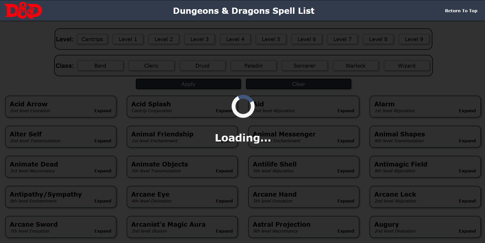
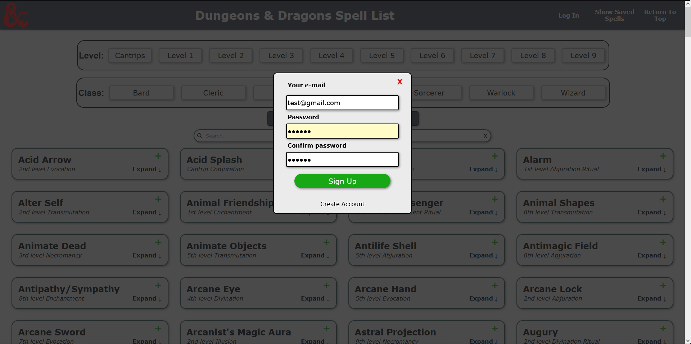
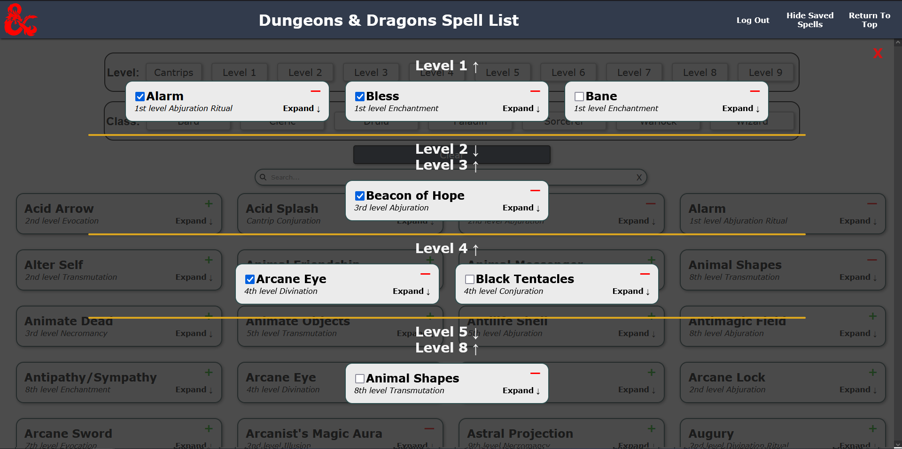

  

   
     
     
    <a href="https://henek123.github.io/dnd-spell-list/" target="_blank"><strong>Explore the website</strong></a>
     
    
  

<!-- ABOUT THE PROJEC -->
## About The Project

dnd-spell-list is a website made in React. Spell list is fetched with the help of GraphQL and Apollo Client from D&D 5e API. 
* When the page is opened, it shows a loading screen until all spells are downloaded from the API.
* After first download spells are stored in cache memory.
* Each spell has own extentable card.
* User can use buttons ath the top of the webiste to filter throught spells.
* Any combination of Paladin class and level 6, 7, 8, 9 filters is disabled because he has no spells higher than level 5.

## Available Scripts

In the project directory, you can run:

### `npm start`

Runs the app in the development mode.
Open [http://localhost:3000](http://localhost:3000) to view it in your browser.

## Used Technologies

* JavaScript
* HTML
* CSS
* React
* GraphQl
* D&D 5e API
* Apollo Client

## Desktop view

## Mobile view
        

<!-- CONTACT -->
## Contact

Artur Bieniek
* e-mail: artur9724@gmail.com
* linkedIn: https://www.linkedin.com/in/artur-bieniek-8406a9245/

Project Link: [https://henek123.github.io/dnd-spell-list/](https://henek123.github.io/dnd-character-sheet/)
